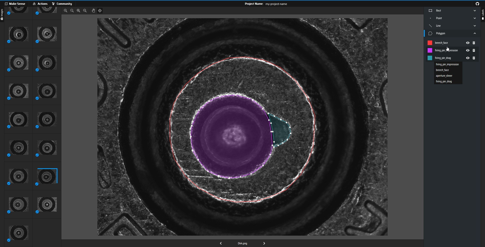
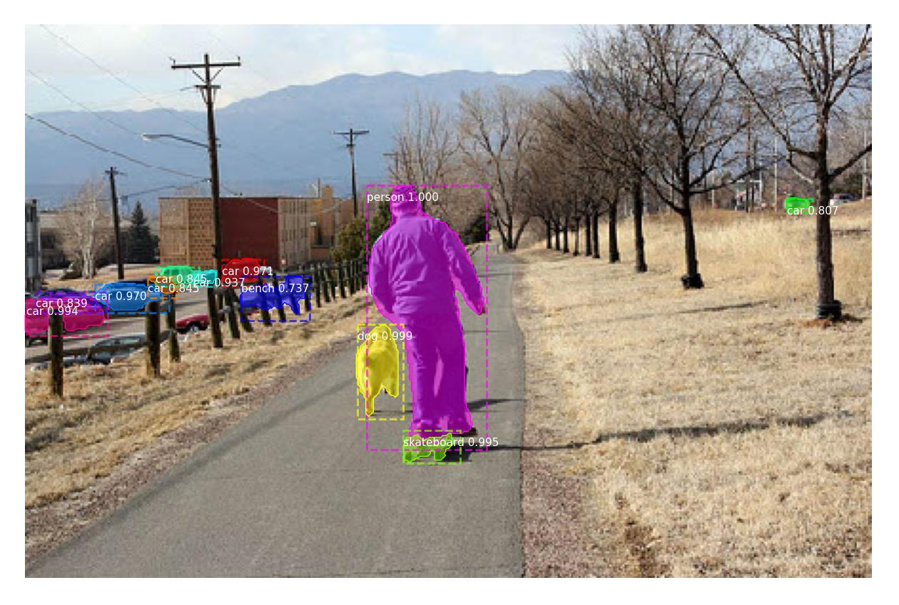
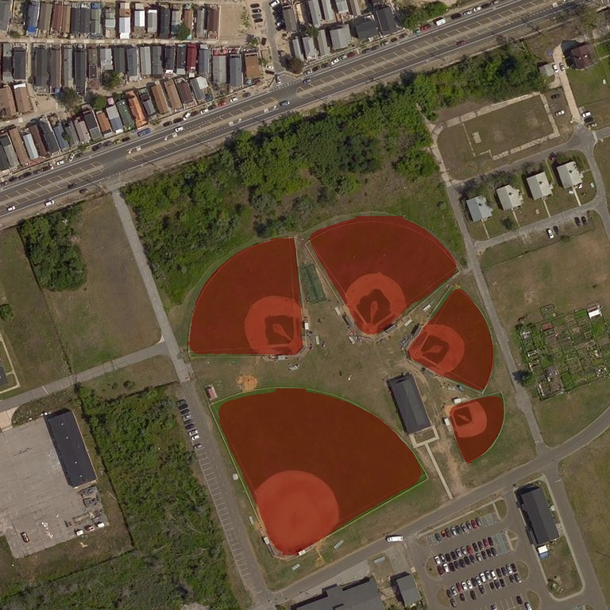

# Mask R-CNN for Cartridge Case Masking on Keras and TensorFlow
This is a respository for my assessment for the job application at Centre of Forensic Sciences, Ministry of the Solicitor General, Toronto, Canada. The task is to automatically mask the cartridge cases in the images. This is an implementation of the [Mask R-CNN](https://arxiv.org/abs/1703.06870) paper which edits the original [Mask_RCNN](https://github.com/matterport/Mask_RCNN) repository (which only supports TensorFlow 1.x), so that it works with newer versions, i.e. Python 3.10.12 and TensorFlow 2.14.0. The Mask R-CNN model generates bounding boxes and segmentation masks for each instance of an object in the image. It's based on Feature Pyramid Network (FPN) and a ResNet101 backbone.

Packages required for this are in `requirements.txt` and `environment.yml`.

## Data folder
The data folder contains the images and the annotations for the training and validation sets that have been manually scraped and annotated by me of 9mm cartridge cases. The annotations are in both COCO and VGG formats. To view the annotations, you can use https://www.makesense.ai/ by importing the images as well as the .json annotation file. 



## Installation
**Using Anaconda:**

1. Clone this repository
  ```bash
  git clone https://github.com/davecodee/cartridge-auto-mask.git
  cd cartridge-auto-mask
  ```

2. Create environment with anaconda and install dependencies:
  ```bash
  conda env create -f environment.yml 
  ```
3. Download pre-trained COCO weights (mask_rcnn_coco.h5) from the [releases page](https://github.com/matterport/Mask_RCNN/releases/download/v2.0/mask_rcnn_coco.h5).

Running the demo.ipynb notebook will show demo of the model on the test images. It displays the input image by drawing the bounding boxes, masks, class labels, and prediction scores over all detected objects:



**From here onwards the sections are quoted from the original [Mask R-CNN](https://github.com/matterport/Mask_RCNN) repository:**

## Citation
Use this bibtex to cite this repository:
```
@misc{matterport_maskrcnn_2017,
  title={Mask R-CNN for object detection and instance segmentation on Keras and TensorFlow},
  author={Waleed Abdulla},
  year={2017},
  publisher={Github},
  journal={GitHub repository},
  howpublished={\url{https://github.com/matterport/Mask_RCNN}},
}

@INPROCEEDINGS{8237584,
  author={He, Kaiming and Gkioxari, Georgia and Dollár, Piotr and Girshick, Ross},
  booktitle={2017 IEEE International Conference on Computer Vision (ICCV)}, 
  title={Mask R-CNN}, 
  year={2017},
  volume={},
  number={},
  pages={2980-2988},
  doi={10.1109/ICCV.2017.322}}
```

## Contribution
Contributions to this repository are welcome. Examples of things you can contribute:
* Speed Improvements. Like re-writing some Python code in TensorFlow.
* Training on other datasets.
* Accuracy Improvements.
* Visualizations and examples.
* Update the TF-1 docker image to support TF-2 implementation

# Projects Using this Model
### [4K Video Demo](https://www.youtube.com/watch?v=OOT3UIXZztE) by Karol Majek.
[](https://www.youtube.com/watch?v=OOT3UIXZztE)

### [Images to OSM](https://github.com/jremillard/images-to-osm): Improve OpenStreetMap by adding baseball, soccer, tennis, football, and basketball fields.


### [Splash of Color](https://engineering.matterport.com/splash-of-color-instance-segmentation-with-mask-r-cnn-and-tensorflow-7c761e238b46). A blog post explaining how to train this model from scratch and use it to implement a color splash effect.


### [Segmenting Nuclei in Microscopy Images](samples/nucleus). Built for the [2018 Data Science Bowl](https://www.kaggle.com/c/data-science-bowl-2018)
Code is in the `samples/nucleus` directory.


### [Detection and Segmentation for Surgery Robots](https://github.com/SUYEgit/Surgery-Robot-Detection-Segmentation) by the NUS Control & Mechatronics Lab.


### [Reconstructing 3D buildings from aerial LiDAR](https://medium.com/geoai/reconstructing-3d-buildings-from-aerial-lidar-with-ai-details-6a81cb3079c0)
A proof of concept project by [Esri](https://www.esri.com/), in collaboration with Nvidia and Miami-Dade County. Along with a great write up and code by Dmitry Kudinov, Daniel Hedges, and Omar Maher.


### [Usiigaci: Label-free Cell Tracking in Phase Contrast Microscopy](https://github.com/oist/usiigaci)
A project from Japan to automatically track cells in a microfluidics platform. Paper is pending, but the source code is released.

 

### [Characterization of Arctic Ice-Wedge Polygons in Very High Spatial Resolution Aerial Imagery](http://www.mdpi.com/2072-4292/10/9/1487)
Research project to understand the complex processes between degradations in the Arctic and climate change. By Weixing Zhang, Chandi Witharana, Anna Liljedahl, and Mikhail Kanevskiy.


### [Mask-RCNN Shiny](https://github.com/huuuuusy/Mask-RCNN-Shiny)
A computer vision class project by HU Shiyu to apply the color pop effect on people with beautiful results.


### [Mapping Challenge](https://github.com/crowdAI/crowdai-mapping-challenge-mask-rcnn): Convert satellite imagery to maps for use by humanitarian organisations.


### [GRASS GIS Addon](https://github.com/ctu-geoforall-lab/i.ann.maskrcnn) to generate vector masks from geospatial imagery. Based on a [Master's thesis](https://github.com/ctu-geoforall-lab-projects/dp-pesek-2018) by Ondřej Pešek.

